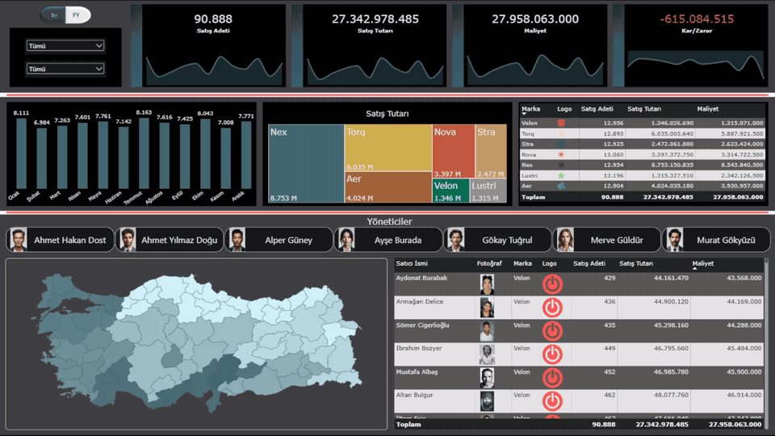
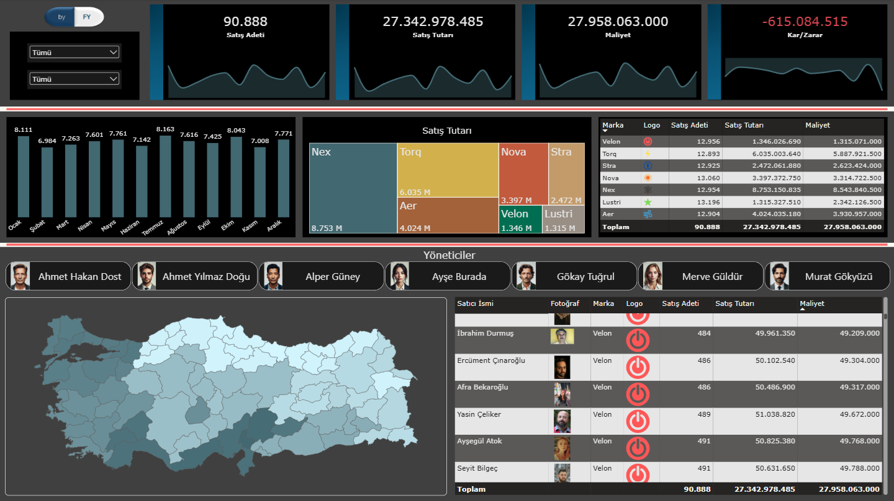

# FY Sales Performance Dashboard

An interactive Power BI dashboard designed to analyze sales performance across brands, cities, and sales representatives in Türkiye.

> **Note:** This is a guided course project created while learning and practicing Power BI. The project was used to apply concepts such as data modeling, DAX measures, interactive filtering, custom tooltips, KPI analysis, and dashboard design.

## Dashboard Demo

## Project Overview

The dashboard analyzes sales performance across seven brands:

- Nex
- Torq
- Nova
- Stra
- Aer
- Velon
- Lustri

The report provides an overview of sales quantities, revenue, costs, and profitability while allowing performance to be analyzed across different brands, years, cities, managers, and sales representatives.

## Dashboard Overview

Provides a comprehensive overview of sales performance, including monthly sales trends, brand-level sales distribution, geographical analysis, and detailed sales representative performance.

## Interactive Features

- Brand and year filtering using slicers
- Dynamic KPIs that respond to filter selections
- Cross-filtering between report visuals
- Interactive brand analysis using a treemap
- Monthly sales performance visualization
- Interactive geographical analysis across Turkish cities
- Custom report page tooltips displaying brand-level sales quantities for each city
- Manager-based filtering
- Detailed sales representative table with profile images and brand logos

## Tools & Technologies

- Power BI Desktop
- Power Query
- DAX
- Data Modeling
- Data Visualization

## Key Metrics

The dashboard tracks:

- Total Sales Quantity
- Total Sales Revenue
- Total Sales Cost
- Total Profit/Loss
- Monthly Sales Quantity
- Sales Revenue by Brand
- Sales Quantity by City
- Sales Representative Performance

## Project File

The Power BI report file is available in this repository:

`Sales_Dashboard.pbix`
